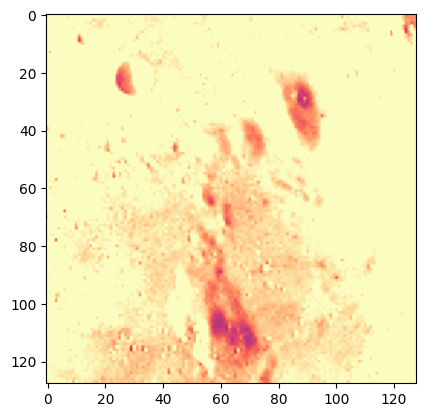
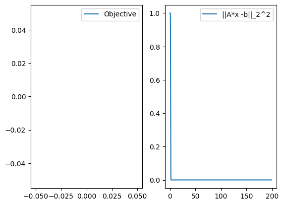

# Denoising

In this simple notebook, we look at a denoising problem and how the linearized bregman iterations provide a simple and efficient solution.

# Packages setup


```julia
# ] registry add https://github.com/slimgroup/SLIMregistryJL.git
# ] add LinearAlgebra, JOLI, TestImages, ImageView
```


```julia
using SlimOptim, LinearAlgebra, JOLI, TestImages, PyPlot
```

# Use a standard reference image


```julia
n = 256
n1, n2 = 2*256, 256
img = Float32.(testimage("lena_gray_16bit.png"));
```


```julia
imshow(img, cmap="magma", vmin=-.5, vmax=.5);
```





# Measurment operator


```julia
A = [joRomberg(n, n; DDT=Float32, RDT=Float32);joRomberg(n, n; DDT=Float32, RDT=Float32)];
```

# Setup transform domain operator


```julia
# Sparse in wavelet domain
W = joDWT(n, n; DDT=Float32, RDT=Float32);
# Or with curvelet ifi nstalled
# W = joCurvelet2D(128, 128; DDT=Float32, RDT=Float32);
```

# Measurements


```julia
# Make noisy data
b = A*vec(img);
```


```julia
imshow(reshape(b, n1, n2), cmap="magma", vmin=-.5, vmax=.5, aspect=.5)
```


    PyObject <matplotlib.image.AxesImage object at 0x14ac18c70>


# Linearized bregman

We solve the following l1-l2 optimization problem:

$$
\begin{align}
\min_x & \ \ \lambda || W x||_1 + \frac{1}{2} ||W x ||_2^2 \\
          & \text{s.t. } Ax = b
\end{align}
$$

where $W$ is the sparsity promoting transform, $x$ is the unknown image and $A$ is a tall measuremment operator.


```julia
# setup bregman
opt = bregman_options(maxIter=200, verbose=2, quantile=.1)
```


    SlimOptim.BregmanParams(2, 1.0e-8, 200, false, true, 0.1)


```julia
sol = bregman(A, W, zeros(Float32, n*n), b, opt);
```

    Running linearized bregman...
    Progress tolerance: 1.00e-08
    Maximum number of iterations: 200
    Anti-chatter correction: 1
     Iteration     Step Length Bregman residual ||A*x - b||_2^2     λ
             1     1.25000e-01     1.48864e+02     4.75737e+03     2.99459e-04 
             2     1.25000e-01     4.55724e+02     2.67720e+03     2.99459e-04 
             3     1.25000e-01     7.95676e+02     1.50593e+03     2.99459e-04 
             4     1.25000e-01     1.11241e+03     8.47091e+02     2.99459e-04 
             5     1.25000e-01     1.38470e+03     4.76491e+02     2.99459e-04 
             6     1.25000e-01     1.60846e+03     2.68028e+02     2.99459e-04 
             7     1.25000e-01     1.78728e+03     1.50766e+02     2.99459e-04 
             8     1.25000e-01     1.92757e+03     8.48065e+01     2.99459e-04 
             9     1.25000e-01     2.03627e+03     4.77039e+01     2.99459e-04 
            10     1.25000e-01     2.11975e+03     2.68337e+01     2.99459e-04 
            11     1.25000e-01     2.18632e+03     1.50940e+01     1.42984e-03 
            12     1.25000e-01     2.23547e+03     8.81974e+00     1.42984e-03 
            13     1.25000e-01     2.27269e+03     4.96397e+00     1.42984e-03 
            14     1.25000e-01     2.30081e+03     2.79504e+00     1.42984e-03 
            15     1.25000e-01     2.32200e+03     1.57486e+00     1.42984e-03 
            16     1.25000e-01     2.33796e+03     8.88252e-01     1.42984e-03 
            17     1.25000e-01     2.34997e+03     5.01863e-01     1.42984e-03 
            18     1.25000e-01     2.35899e+03     2.84326e-01     1.42984e-03 
            19     1.25000e-01     2.36577e+03     1.61829e-01     1.42984e-03 
            20     1.25000e-01     2.37086e+03     9.28416e-02     1.42984e-03 
            21     1.25000e-01     2.37761e+03     5.40014e-02     2.52146e-03 
            22     1.25000e-01     2.38118e+03     1.31801e-01     2.52146e-03 
            23     1.25000e-01     2.38383e+03     8.25535e-02     2.52146e-03 
            24     1.25000e-01     2.38582e+03     5.43265e-02     2.52146e-03 
            25     1.25000e-01     2.38732e+03     3.78512e-02     2.52146e-03 
            26     1.25000e-01     2.38844e+03     2.79190e-02     2.52146e-03 
            27     1.25000e-01     2.38929e+03     2.16570e-02     2.52146e-03 
            28     1.25000e-01     2.38993e+03     1.74611e-02     2.52146e-03 
            29     1.25000e-01     2.39042e+03     1.44713e-02     2.52146e-03 
            30     1.25000e-01     2.39080e+03     1.21932e-02     2.52146e-03 
            31     1.25000e-01     2.39378e+03     1.03789e-02     3.49909e-03 
            32     1.25000e-01     2.39453e+03     9.09539e-02     3.49909e-03 
            33     1.25000e-01     2.39511e+03     6.70223e-02     3.49909e-03 
            34     1.25000e-01     2.39556e+03     5.15073e-02     3.49909e-03 
            35     1.25000e-01     2.39591e+03     4.11505e-02     3.49909e-03 
            36     1.25000e-01     2.39618e+03     3.39748e-02     3.49909e-03 
            37     1.25000e-01     2.39639e+03     2.88185e-02     3.49909e-03 
            38     1.25000e-01     2.39656e+03     2.49902e-02     3.49909e-03 
            39     1.25000e-01     2.39669e+03     2.20824e-02     3.49909e-03 
            40     1.25000e-01     2.39679e+03     1.98347e-02     3.49909e-03 
            41     1.25000e-01     2.39923e+03     1.80850e-02     4.33748e-03 
            42     1.25000e-01     2.39967e+03     9.52648e-02     4.33748e-03 
            43     1.25000e-01     2.40002e+03     7.99760e-02     4.33748e-03 
            44     1.25000e-01     2.40031e+03     6.95839e-02     4.33748e-03 
            45     1.25000e-01     2.40054e+03     6.21067e-02     4.33748e-03 
            46     1.25000e-01     2.40073e+03     5.63292e-02     4.33748e-03 
            47     1.25000e-01     2.40090e+03     5.15754e-02     4.33748e-03 
            48     1.25000e-01     2.40105e+03     4.74253e-02     4.33748e-03 
            49     1.25000e-01     2.40118e+03     4.36792e-02     4.33748e-03 
            50     1.25000e-01     2.40129e+03     4.01961e-02     4.33748e-03 
            51     1.25000e-01     2.40320e+03     3.69216e-02     4.96721e-03 
            52     1.25000e-01     2.40359e+03     9.53462e-02     4.96721e-03 
            53     1.25000e-01     2.40391e+03     8.20759e-02     4.96721e-03 
            54     1.25000e-01     2.40419e+03     7.17705e-02     4.96721e-03 
            55     1.25000e-01     2.40442e+03     6.33917e-02     4.96721e-03 
            56     1.25000e-01     2.40463e+03     5.63082e-02     4.96721e-03 
            57     1.25000e-01     2.40481e+03     5.01847e-02     4.96721e-03 
            58     1.25000e-01     2.40497e+03     4.47861e-02     4.96721e-03 
            59     1.25000e-01     2.40511e+03     3.99913e-02     4.96721e-03 
            60     1.25000e-01     2.40525e+03     3.57015e-02     4.96721e-03 
            61     1.25000e-01     2.40736e+03     3.18678e-02     5.65533e-03 
            62     1.25000e-01     2.40780e+03     9.48295e-02     5.65533e-03 
            63     1.25000e-01     2.40817e+03     7.93026e-02     5.65533e-03 
            64     1.25000e-01     2.40849e+03     6.75133e-02     5.65533e-03 
            65     1.25000e-01     2.40875e+03     5.82329e-02     5.65533e-03 
            66     1.25000e-01     2.40898e+03     5.06981e-02     5.65533e-03 
            67     1.25000e-01     2.40918e+03     4.44525e-02     5.65533e-03 
            68     1.25000e-01     2.40936e+03     3.91909e-02     5.65533e-03 
            69     1.25000e-01     2.40951e+03     3.47124e-02     5.65533e-03 
            70     1.25000e-01     2.40965e+03     3.08569e-02     5.65533e-03 
            71     1.25000e-01     2.41192e+03     2.75181e-02     6.38341e-03 
            72     1.25000e-01     2.41240e+03     9.30221e-02     6.38341e-03 
            73     1.25000e-01     2.41281e+03     7.65585e-02     6.38341e-03 
            74     1.25000e-01     2.41314e+03     6.43722e-02     6.38341e-03 
            75     1.25000e-01     2.41343e+03     5.50533e-02     6.38341e-03 
            76     1.25000e-01     2.41367e+03     4.77050e-02     6.38341e-03 
            77     1.25000e-01     2.41388e+03     4.17815e-02     6.38341e-03 
            78     1.25000e-01     2.41406e+03     3.69022e-02     6.38341e-03 
            79     1.25000e-01     2.41422e+03     3.28233e-02     6.38341e-03 
            80     1.25000e-01     2.41436e+03     2.93602e-02     6.38341e-03 
            81     1.25000e-01     2.41674e+03     2.63915e-02     7.13889e-03 
            82     1.25000e-01     2.41725e+03     9.33843e-02     7.13889e-03 
            83     1.25000e-01     2.41768e+03     7.64113e-02     7.13889e-03 
            84     1.25000e-01     2.41803e+03     6.40490e-02     7.13889e-03 
            85     1.25000e-01     2.41833e+03     5.47431e-02     7.13889e-03 
            86     1.25000e-01     2.41858e+03     4.75155e-02     7.13889e-03 
            87     1.25000e-01     2.41880e+03     4.17613e-02     7.13889e-03 
            88     1.25000e-01     2.41898e+03     3.70686e-02     7.13889e-03 
            89     1.25000e-01     2.41914e+03     3.31771e-02     7.13889e-03 
            90     1.25000e-01     2.41928e+03     2.98934e-02     7.13889e-03 
            91     1.25000e-01     2.42174e+03     2.70862e-02     7.91021e-03 
            92     1.25000e-01     2.42228e+03     9.49944e-02     7.91021e-03 
            93     1.25000e-01     2.42273e+03     7.76408e-02     7.91021e-03 
            94     1.25000e-01     2.42310e+03     6.50968e-02     7.91021e-03 
            95     1.25000e-01     2.42341e+03     5.57374e-02     7.91021e-03 
            96     1.25000e-01     2.42366e+03     4.85352e-02     7.91021e-03 
            97     1.25000e-01     2.42388e+03     4.28481e-02     7.91021e-03 
            98     1.25000e-01     2.42407e+03     3.82393e-02     7.91021e-03 
            99     1.25000e-01     2.42423e+03     3.44296e-02     7.91021e-03 
           100     1.25000e-01     2.42437e+03     3.12197e-02     7.91021e-03 
           101     1.25000e-01     2.42689e+03     2.84783e-02     8.68707e-03 
           102     1.25000e-01     2.42745e+03     9.65193e-02     8.68707e-03 
           103     1.25000e-01     2.42791e+03     7.90365e-02     8.68707e-03 
           104     1.25000e-01     2.42829e+03     6.64621e-02     8.68707e-03 
           105     1.25000e-01     2.42860e+03     5.71290e-02     8.68707e-03 
           106     1.25000e-01     2.42887e+03     4.99854e-02     8.68707e-03 
           107     1.25000e-01     2.42909e+03     4.43675e-02     8.68707e-03 
           108     1.25000e-01     2.42928e+03     3.98289e-02     8.68707e-03 
           109     1.25000e-01     2.42945e+03     3.60829e-02     8.68707e-03 
           110     1.25000e-01     2.42959e+03     3.29215e-02     8.68707e-03 
           111     1.25000e-01     2.43216e+03     3.02073e-02     9.47051e-03 
           112     1.25000e-01     2.43274e+03     9.89313e-02     9.47051e-03 
           113     1.25000e-01     2.43321e+03     8.12606e-02     9.47051e-03 
           114     1.25000e-01     2.43361e+03     6.85909e-02     9.47051e-03 
           115     1.25000e-01     2.43393e+03     5.92209e-02     9.47051e-03 
           116     1.25000e-01     2.43420e+03     5.20683e-02     9.47051e-03 
           117     1.25000e-01     2.43443e+03     4.64455e-02     9.47051e-03 
           118     1.25000e-01     2.43463e+03     4.18961e-02     9.47051e-03 
           119     1.25000e-01     2.43480e+03     3.81351e-02     9.47051e-03 
           120     1.25000e-01     2.43494e+03     3.49568e-02     9.47051e-03 
           121     1.25000e-01     2.43754e+03     3.22196e-02     1.02485e-02 
           122     1.25000e-01     2.43813e+03     1.00318e-01     1.02485e-02 
           123     1.25000e-01     2.43862e+03     8.27781e-02     1.02485e-02 
           124     1.25000e-01     2.43902e+03     7.02139e-02     1.02485e-02 
           125     1.25000e-01     2.43935e+03     6.09267e-02     1.02485e-02 
           126     1.25000e-01     2.43963e+03     5.38352e-02     1.02485e-02 
           127     1.25000e-01     2.43986e+03     4.82562e-02     1.02485e-02 
           128     1.25000e-01     2.44006e+03     4.37412e-02     1.02485e-02 
           129     1.25000e-01     2.44023e+03     3.99959e-02     1.02485e-02 
           130     1.25000e-01     2.44038e+03     3.68180e-02     1.02485e-02 
           131     1.25000e-01     2.44302e+03     3.40751e-02     1.10259e-02 
           132     1.25000e-01     2.44362e+03     1.02179e-01     1.10259e-02 
           133     1.25000e-01     2.44412e+03     8.46594e-02     1.10259e-02 
           134     1.25000e-01     2.44453e+03     7.21285e-02     1.10259e-02 
           135     1.25000e-01     2.44487e+03     6.28762e-02     1.10259e-02 
           136     1.25000e-01     2.44516e+03     5.58117e-02     1.10259e-02 
           137     1.25000e-01     2.44540e+03     5.02531e-02     1.10259e-02 
           138     1.25000e-01     2.44560e+03     4.57472e-02     1.10259e-02 
           139     1.25000e-01     2.44577e+03     4.20006e-02     1.10259e-02 
           140     1.25000e-01     2.44592e+03     3.88105e-02     1.10259e-02 
           141     1.25000e-01     2.44856e+03     3.60418e-02     1.17898e-02 
           142     1.25000e-01     2.44917e+03     1.02472e-01     1.17898e-02 
           143     1.25000e-01     2.44968e+03     8.53659e-02     1.17898e-02 
           144     1.25000e-01     2.45009e+03     7.31150e-02     1.17898e-02 
           145     1.25000e-01     2.45044e+03     6.40482e-02     1.17898e-02 
           146     1.25000e-01     2.45073e+03     5.71030e-02     1.17898e-02 
           147     1.25000e-01     2.45097e+03     5.16177e-02     1.17898e-02 
           148     1.25000e-01     2.45118e+03     4.71545e-02     1.17898e-02 
           149     1.25000e-01     2.45135e+03     4.34283e-02     1.17898e-02 
           150     1.25000e-01     2.45150e+03     4.02401e-02     1.17898e-02 
           151     1.25000e-01     2.45420e+03     3.74608e-02     1.25622e-02 
           152     1.25000e-01     2.45484e+03     1.04930e-01     1.25622e-02 
           153     1.25000e-01     2.45536e+03     8.75396e-02     1.25622e-02 
           154     1.25000e-01     2.45579e+03     7.51056e-02     1.25622e-02 
           155     1.25000e-01     2.45614e+03     6.59137e-02     1.25622e-02 
           156     1.25000e-01     2.45644e+03     5.88758e-02     1.25622e-02 
           157     1.25000e-01     2.45669e+03     5.33115e-02     1.25622e-02 
           158     1.25000e-01     2.45690e+03     4.87786e-02     1.25622e-02 
           159     1.25000e-01     2.45708e+03     4.49885e-02     1.25622e-02 
           160     1.25000e-01     2.45724e+03     4.17442e-02     1.25622e-02 
           161     1.25000e-01     2.45994e+03     3.89159e-02     1.33246e-02 
           162     1.25000e-01     2.46059e+03     1.05203e-01     1.33246e-02 
           163     1.25000e-01     2.46112e+03     8.80553e-02     1.33246e-02 
           164     1.25000e-01     2.46156e+03     7.57770e-02     1.33246e-02 
           165     1.25000e-01     2.46192e+03     6.66882e-02     1.33246e-02 
           166     1.25000e-01     2.46222e+03     5.97201e-02     1.33246e-02 
           167     1.25000e-01     2.46247e+03     5.42062e-02     1.33246e-02 
           168     1.25000e-01     2.46269e+03     4.97058e-02     1.33246e-02 
           169     1.25000e-01     2.46287e+03     4.59313e-02     1.33246e-02 
           170     1.25000e-01     2.46303e+03     4.26935e-02     1.33246e-02 
           171     1.25000e-01     2.46575e+03     3.98715e-02     1.40819e-02 
           172     1.25000e-01     2.46641e+03     1.05433e-01     1.40819e-02 
           173     1.25000e-01     2.46695e+03     8.84902e-02     1.40819e-02 
           174     1.25000e-01     2.46739e+03     7.63617e-02     1.40819e-02 
           175     1.25000e-01     2.46776e+03     6.73878e-02     1.40819e-02 
           176     1.25000e-01     2.46806e+03     6.05122e-02     1.40819e-02 
           177     1.25000e-01     2.46832e+03     5.50697e-02     1.40819e-02 
           178     1.25000e-01     2.46854e+03     5.06265e-02     1.40819e-02 
           179     1.25000e-01     2.46872e+03     4.69040e-02     1.40819e-02 
           180     1.25000e-01     2.46888e+03     4.37125e-02     1.40819e-02 
           181     1.25000e-01     2.47164e+03     4.09215e-02     1.48376e-02 
           182     1.25000e-01     2.47231e+03     1.06274e-01     1.48376e-02 
           183     1.25000e-01     2.47286e+03     8.94202e-02     1.48376e-02 
           184     1.25000e-01     2.47331e+03     7.73723e-02     1.48376e-02 
           185     1.25000e-01     2.47368e+03     6.84566e-02     1.48376e-02 
           186     1.25000e-01     2.47400e+03     6.16259e-02     1.48376e-02 
           187     1.25000e-01     2.47426e+03     5.62199e-02     1.48376e-02 
           188     1.25000e-01     2.47448e+03     5.18038e-02     1.48376e-02 
           189     1.25000e-01     2.47466e+03     4.80991e-02     1.48376e-02 
           190     1.25000e-01     2.47483e+03     4.49140e-02     1.48376e-02 
           191     1.25000e-01     2.47755e+03     4.21247e-02     1.55749e-02 
           192     1.25000e-01     2.47823e+03     1.05078e-01     1.55749e-02 
           193     1.25000e-01     2.47878e+03     8.88411e-02     1.55749e-02 
           194     1.25000e-01     2.47923e+03     7.72112e-02     1.55749e-02 
           195     1.25000e-01     2.47960e+03     6.85885e-02     1.55749e-02 
           196     1.25000e-01     2.47991e+03     6.19594e-02     1.55749e-02 
           197     1.25000e-01     2.48017e+03     5.66954e-02     1.55749e-02 
           198     1.25000e-01     2.48039e+03     5.23860e-02     1.55749e-02 
           199     1.25000e-01     2.48058e+03     4.87545e-02     1.55749e-02 
           200     1.25000e-01     2.48074e+03     4.56219e-02     1.55749e-02 


# Plot result and convergence


```julia
figure(figsize=(8,8));
subplot(221)
imshow(img, cmap="magma", vmin=-.5, vmax=.5)
title("True")
subplot(222)
imshow(reshape(b, n1, n2), cmap="magma", vmin=-.5, vmax=.5, aspect=.5)
title("Measurment")
subplot(223)
imshow(reshape(sol.x, n, n), cmap="magma", vmin=-.5, vmax=.5)
title("recovered")
subplot(224)
imshow(img - reshape(sol.x, n, n), cmap="seismic", vmin=-.5e-2, vmax=.5e-2)
title("Difference x100")
tight_layout()
```


```julia
figure()
subplot(121)
plot(sol.ϕ_trace/sol.ϕ_trace[1], label="Objective")
legend()
subplot(122)
plot(sol.r_trace/sol.r_trace[1], label="||A*x -b||_2^2")
legend()
```





    PyObject <matplotlib.legend.Legend object at 0x14aef2d60>


