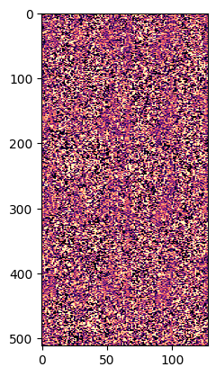
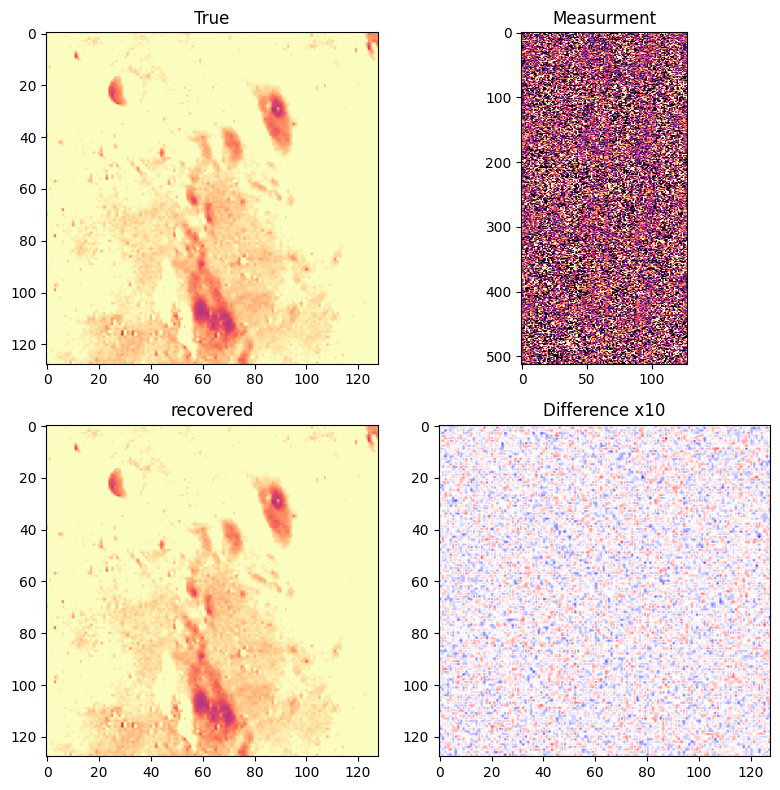

# Denoising

In this simple notebook, we look at a denoising problem and how the linearized bregman iterations provide a simple and efficient solution.

# Packages setup


```julia
# ] registry add https://github.com/slimgroup/SLIMregistryJL.git
# ] add LinearAlgebra, JOLI, TestImages, ImageView
```


```julia
using SlimOptim, LinearAlgebra, JOLI, TestImages, PyPlot
import TestImages: Gray
```

# Use a standard reference image


```julia
n = 128
k = 4
n1, n2 = k*n, n
img = Float32.(testimage("moonsurface.png"))
img = img[1:2:end, 1:2:end];
```

    ┌ Warning: "moonsurface.png" not found in `TestImages.remotefiles`. Load "moonsurface.tiff" instead.
    └ @ TestImages ~/.julia/packages/TestImages/1zo60/src/TestImages.jl:163


```julia
imshow(img, cmap="magma", vmin=-.5, vmax=.5);
```


    

    


# Measurment operator


```julia
A = vcat([joRomberg(n, n; DDT=Float32, RDT=Float32) for i=1:k]...);
```

# Setup transform domain operator


```julia
# Sparse in wavelet domain
W = joDWT(n, n; DDT=Float32, RDT=Float32);
# Or with curvelet ifi nstalled
# W = joCurvelet2D(128, 128; DDT=Float32, RDT=Float32);
```

# Measurements


```julia
# Make noisy data
b = A*vec(img);
b += .01f0*randn(Float32, size(b));
```


```julia
imshow(reshape(b, n1, n2), cmap="magma", vmin=-.5, vmax=.5, aspect=.5)
```


    

    


    PyObject <matplotlib.image.AxesImage object at 0x15a768810>


# Linearized bregman

We solve the following l1-l2 optimization problem:

$$
\begin{align}
\min_x & \ \ \lambda || W x||_1 + \frac{1}{2} ||W x ||_2^2 \\
          & \text{s.t. } Ax = b
\end{align}
$$

where $W$ is the sparsity promoting transform, $x$ is the unknown image and $A$ is a tall measuremment operator.


```julia
# setup bregman
opt = bregman_options(maxIter=200, verbose=2, quantile=.5, antichatter=true, spg=true)
```


    SlimOptim.BregmanParams(2, 1.0e-8, 200, false, true, 0.5, true, UniformScaling{Bool}(true), SlimOptim.var"#35#38"{Int64}(Core.Box(SlimOptim.var"#34#37"{Float64}(0.5)), 1), nothing)


```julia
sol = bregman(A, W, zeros(Float32, n*n), b, opt);
```

    Running linearized bregman...
    Progress tolerance: 1.00e-08


    ┌ Warning: deprecation warning: please put TD in options (BregmanParams) for version > 0.1.7; now overwritting TD in BregmanParams
    └ @ SlimOptim ~/.julia/dev/SlimOptim/src/bregman.jl:88


    Maximum number of iterations: 200
    Anti-chatter correction: 1
     Iteration     Step Length        L1-2     ||A*x - b||_2^2     λ
             1             NaN     0.00000e+00     8.62052e+03     1.34803e-06 
             2     2.49999e-01     7.31164e-06     8.61953e+03     1.34803e-06 
             3     2.50000e-01     2.15437e+03     2.42224e+00     1.34803e-06 
             4     2.50122e-01     2.15439e+03     2.42225e+00     1.34803e-06 
             5     2.26376e-01     2.15439e+03     2.42225e+00     1.34803e-06 
             6     2.12187e-01     2.15439e+03     2.42225e+00     1.34803e-06 
             7     2.20533e-01     2.15439e+03     2.42225e+00     1.34803e-06 
             8     2.23766e-01     2.15439e+03     2.42225e+00     1.34803e-06 
             9     2.38927e-01     2.15439e+03     2.42225e+00     1.34803e-06 
            10     2.14379e-01     2.15439e+03     2.42225e+00     1.34803e-06 
            11     2.34470e-01     2.15439e+03     2.42225e+00     1.34803e-06 
            12     2.15027e-01     2.15439e+03     2.42225e+00     1.34803e-06 
            13     2.24045e-01     2.15439e+03     2.42225e+00     1.34803e-06 
            14     2.34628e-01     2.15439e+03     2.42225e+00     1.34803e-06 
            15     2.18051e-01     2.15439e+03     2.42225e+00     1.34803e-06 
            16     2.17515e-01     2.15439e+03     2.42225e+00     1.34803e-06 
            17     2.29519e-01     2.15439e+03     2.42225e+00     1.34803e-06 
            18     2.36955e-01     2.15439e+03     2.42225e+00     1.34803e-06 
            19     2.21663e-01     2.15439e+03     2.42225e+00     1.34803e-06 
            20     2.25470e-01     2.15439e+03     2.42225e+00     1.34803e-06 
            21     2.19846e-01     2.15439e+03     2.42225e+00     1.34803e-06 
            22     2.32800e-01     2.15439e+03     2.42225e+00     1.34803e-06 
            23     2.40217e-01     2.15439e+03     2.42225e+00     1.34803e-06 
            24     2.36370e-01     2.15439e+03     2.42225e+00     1.34803e-06 
            25     2.33961e-01     2.15439e+03     2.42225e+00     1.34803e-06 
            26     2.29990e-01     2.15439e+03     2.42225e+00     1.34803e-06 
            27     2.36148e-01     2.15439e+03     2.42225e+00     1.34803e-06 
            28     2.32906e-01     2.15439e+03     2.42225e+00     1.34803e-06 
            29     2.33554e-01     2.15439e+03     2.42225e+00     1.34803e-06 
            30     2.27688e-01     2.15439e+03     2.42225e+00     1.34803e-06 
            31     2.32639e-01     2.15439e+03     2.42225e+00     1.34803e-06 
            32     2.35499e-01     2.15439e+03     2.42225e+00     1.34803e-06 
            33     2.25534e-01     2.15439e+03     2.42225e+00     1.34803e-06 
            34     2.33337e-01     2.15439e+03     2.42225e+00     1.34803e-06 
            35     2.30884e-01     2.15439e+03     2.42225e+00     1.34803e-06 
            36     2.34967e-01     2.15439e+03     2.42225e+00     1.34803e-06 
            37     2.25144e-01     2.15439e+03     2.42225e+00     1.34803e-06 
            38     2.31633e-01     2.15439e+03     2.42225e+00     1.34803e-06 
            39     2.37660e-01     2.15439e+03     2.42225e+00     1.34803e-06 
            40     2.27150e-01     2.15439e+03     2.42225e+00     1.34803e-06 
            41     2.22052e-01     2.15439e+03     2.42225e+00     1.34803e-06 
            42     2.38896e-01     2.15439e+03     2.42225e+00     1.34803e-06 
            43     2.40635e-01     2.15439e+03     2.42225e+00     1.34803e-06 
            44     2.35120e-01     2.15439e+03     2.42225e+00     1.34803e-06 
            45     2.37571e-01     2.15439e+03     2.42225e+00     1.34803e-06 
            46     2.30785e-01     2.15439e+03     2.42225e+00     1.34803e-06 
            47     2.33857e-01     2.15439e+03     2.42225e+00     1.34803e-06 
            48     2.88152e-01     2.15439e+03     2.42225e+00     1.34803e-06 
            49     2.33997e-01     2.15439e+03     2.42225e+00     1.34803e-06 
            50     2.19139e-01     2.15439e+03     2.42225e+00     1.34803e-06 
            51     2.15152e-01     2.15439e+03     2.42225e+00     1.34803e-06 
            52     2.16717e-01     2.15439e+03     2.42225e+00     1.34803e-06 
            53     2.32711e-01     2.15439e+03     2.42225e+00     1.34803e-06 
            54     2.35338e-01     2.15439e+03     2.42225e+00     1.34803e-06 
            55     2.22194e-01     2.15439e+03     2.42225e+00     1.34803e-06 
            56     2.17572e-01     2.15439e+03     2.42225e+00     1.34803e-06 
            57     2.17238e-01     2.15439e+03     2.42225e+00     1.34803e-06 
            58     2.13686e-01     2.15439e+03     2.42225e+00     1.34803e-06 
            59     2.32201e-01     2.15439e+03     2.42225e+00     1.34803e-06 
            60     2.30792e-01     2.15439e+03     2.42225e+00     1.34803e-06 
            61     2.44029e-01     2.15439e+03     2.42225e+00     1.34803e-06 
            62     2.38545e-01     2.15439e+03     2.42225e+00     1.34803e-06 
            63     2.32890e-01     2.15439e+03     2.42225e+00     1.34803e-06 
            64     2.36892e-01     2.15439e+03     2.42225e+00     1.34803e-06 
            65     2.30349e-01     2.15439e+03     2.42225e+00     1.34803e-06 
            66     2.28569e-01     2.15439e+03     2.42225e+00     1.34803e-06 
            67     2.33111e-01     2.15439e+03     2.42225e+00     1.34803e-06 
            68     2.28576e-01     2.15439e+03     2.42225e+00     1.34803e-06 
            69     2.38222e-01     2.15439e+03     2.42225e+00     1.34803e-06 
            70     2.31610e-01     2.15439e+03     2.42225e+00     1.34803e-06 
            71     2.27397e-01     2.15439e+03     2.42225e+00     1.34803e-06 
            72     2.39834e-01     2.15439e+03     2.42225e+00     1.34803e-06 
            73     2.28993e-01     2.15439e+03     2.42225e+00     1.34803e-06 
            74     2.25153e-01     2.15439e+03     2.42225e+00     1.34803e-06 
            75     2.38148e-01     2.15439e+03     2.42225e+00     1.34803e-06 
            76     2.38356e-01     2.15439e+03     2.42225e+00     1.34803e-06 
            77     2.44641e-01     2.15439e+03     2.42225e+00     1.34803e-06 
            78     2.90175e-01     2.15439e+03     2.42225e+00     1.34803e-06 
            79     2.38272e-01     2.15439e+03     2.42225e+00     1.34803e-06 
            80     2.27486e-01     2.15439e+03     2.42225e+00     1.34803e-06 
            81     2.32778e-01     2.15439e+03     2.42225e+00     1.34803e-06 
            82     2.25604e-01     2.15439e+03     2.42225e+00     1.34803e-06 
            83     2.26262e-01     2.15439e+03     2.42225e+00     1.34803e-06 
            84     2.11050e-01     2.15439e+03     2.42225e+00     1.34803e-06 
            85     2.06730e-01     2.15439e+03     2.42225e+00     1.34803e-06 
            86     2.39487e-01     2.15439e+03     2.42225e+00     1.34803e-06 
            87     2.29575e-01     2.15439e+03     2.42225e+00     1.34803e-06 
            88     2.22524e-01     2.15439e+03     2.42225e+00     1.34803e-06 
            89     2.17675e-01     2.15439e+03     2.42225e+00     1.34803e-06 
            90     2.31493e-01     2.15439e+03     2.42225e+00     1.34803e-06 
            91     2.16341e-01     2.15439e+03     2.42225e+00     1.34803e-06 
            92     2.24872e-01     2.15439e+03     2.42225e+00     1.34803e-06 
            93     2.16945e-01     2.15439e+03     2.42225e+00     1.34803e-06 
            94     2.24635e-01     2.15439e+03     2.42225e+00     1.34803e-06 
            95     2.23042e-01     2.15439e+03     2.42225e+00     1.34803e-06 
            96     2.34892e-01     2.15439e+03     2.42225e+00     1.34803e-06 
            97     2.27087e-01     2.15439e+03     2.42225e+00     1.34803e-06 
            98     2.17167e-01     2.15439e+03     2.42225e+00     1.34803e-06 
            99     2.25401e-01     2.15439e+03     2.42225e+00     1.34803e-06 
           100     2.34606e-01     2.15439e+03     2.42225e+00     1.34803e-06 
           101     2.38159e-01     2.15439e+03     2.42225e+00     1.34803e-06 
           102     2.22516e-01     2.15439e+03     2.42225e+00     1.34803e-06 
           103     2.44695e-01     2.15439e+03     2.42225e+00     1.34803e-06 
           104     2.39945e-01     2.15439e+03     2.42225e+00     1.34803e-06 
           105     2.27302e-01     2.15439e+03     2.42225e+00     1.34803e-06 
           106     2.22394e-01     2.15439e+03     2.42225e+00     1.34803e-06 
           107     2.11417e-01     2.15439e+03     2.42225e+00     1.34803e-06 
           108     2.68428e-01     2.15439e+03     2.42225e+00     1.34803e-06 
           109     2.32341e-01     2.15439e+03     2.42225e+00     1.34803e-06 
           110     2.22020e-01     2.15439e+03     2.42225e+00     1.34803e-06 
           111     2.20446e-01     2.15439e+03     2.42225e+00     1.34803e-06 
           112     2.35209e-01     2.15439e+03     2.42225e+00     1.34803e-06 
           113     2.31724e-01     2.15439e+03     2.42225e+00     1.34803e-06 
           114     2.14602e-01     2.15439e+03     2.42225e+00     1.34803e-06 
           115     2.30873e-01     2.15439e+03     2.42225e+00     1.34803e-06 
           116     2.36182e-01     2.15439e+03     2.42225e+00     1.34803e-06 
           117     2.17700e-01     2.15439e+03     2.42225e+00     1.34803e-06 
           118     2.31121e-01     2.15439e+03     2.42225e+00     1.34803e-06 
           119     2.26273e-01     2.15439e+03     2.42225e+00     1.34803e-06 
           120     2.28442e-01     2.15439e+03     2.42225e+00     1.34803e-06 
           121     2.36458e-01     2.15439e+03     2.42225e+00     1.34803e-06 
           122     2.19529e-01     2.15439e+03     2.42225e+00     1.34803e-06 
           123     2.18114e-01     2.15439e+03     2.42225e+00     1.34803e-06 
           124     2.23112e-01     2.15439e+03     2.42225e+00     1.34803e-06 
           125     2.30561e-01     2.15439e+03     2.42225e+00     1.34803e-06 
           126     2.31983e-01     2.15439e+03     2.42225e+00     1.34803e-06 
           127     2.39946e-01     2.15439e+03     2.42225e+00     1.34803e-06 
           128     2.30612e-01     2.15439e+03     2.42225e+00     1.34803e-06 
           129     2.28289e-01     2.15439e+03     2.42225e+00     1.34803e-06 
           130     2.20381e-01     2.15439e+03     2.42225e+00     1.34803e-06 
           131     2.19100e-01     2.15439e+03     2.42225e+00     1.34803e-06 
           132     2.28832e-01     2.15439e+03     2.42225e+00     1.34803e-06 
           133     2.01979e-01     2.15439e+03     2.42225e+00     1.34803e-06 
           134     2.56993e-01     2.15439e+03     2.42225e+00     1.34803e-06 
           135     2.35915e-01     2.15439e+03     2.42225e+00     1.34803e-06 
           136     2.39654e-01     2.15439e+03     2.42225e+00     1.34803e-06 
           137     2.35434e-01     2.15439e+03     2.42225e+00     1.34803e-06 
           138     2.43991e-01     2.15439e+03     2.42225e+00     1.34803e-06 
           139     2.42739e-01     2.15439e+03     2.42225e+00     1.34803e-06 
           140     2.39365e-01     2.15439e+03     2.42225e+00     1.34803e-06 
           141     2.38661e-01     2.15439e+03     2.42225e+00     1.34803e-06 
           142     2.10096e-01     2.15439e+03     2.42225e+00     1.34803e-06 
           143     2.23454e-01     2.15439e+03     2.42225e+00     1.34803e-06 
           144     2.27167e-01     2.15439e+03     2.42225e+00     1.34803e-06 
           145     2.37637e-01     2.15439e+03     2.42225e+00     1.34803e-06 
           146     2.15325e-01     2.15439e+03     2.42224e+00     1.34803e-06 
           147     2.24937e-01     2.15439e+03     2.42225e+00     1.34803e-06 
           148     2.39013e-01     2.15439e+03     2.42225e+00     1.34803e-06 
           149     2.35509e-01     2.15439e+03     2.42225e+00     1.34803e-06 
           150     2.30825e-01     2.15439e+03     2.42225e+00     1.34803e-06 
           151     2.89046e-01     2.15439e+03     2.42225e+00     1.34803e-06 
           152     2.34444e-01     2.15439e+03     2.42225e+00     1.34803e-06 
           153     2.40667e-01     2.15439e+03     2.42225e+00     1.34803e-06 
           154     2.33535e-01     2.15439e+03     2.42225e+00     1.34803e-06 
           155     2.32912e-01     2.15439e+03     2.42225e+00     1.34803e-06 
           156     2.29976e-01     2.15439e+03     2.42225e+00     1.34803e-06 
           157     2.23140e-01     2.15439e+03     2.42225e+00     1.34803e-06 
           158     2.13382e-01     2.15439e+03     2.42225e+00     1.34803e-06 
           159     2.38296e-01     2.15439e+03     2.42225e+00     1.34803e-06 
           160     2.38884e-01     2.15439e+03     2.42225e+00     1.34803e-06 
           161     2.32889e-01     2.15439e+03     2.42225e+00     1.34803e-06 
           162     2.80621e-01     2.15439e+03     2.42225e+00     1.34803e-06 
           163     2.30690e-01     2.15439e+03     2.42225e+00     1.34803e-06 
           164     2.20397e-01     2.15439e+03     2.42225e+00     1.34803e-06 
           165     2.30224e-01     2.15439e+03     2.42225e+00     1.34803e-06 
           166     2.33585e-01     2.15439e+03     2.42225e+00     1.34803e-06 
           167     2.26235e-01     2.15439e+03     2.42225e+00     1.34803e-06 
           168     2.49580e-01     2.15439e+03     2.42225e+00     1.34803e-06 
           169     2.41928e-01     2.15439e+03     2.42225e+00     1.34803e-06 
           170     2.39097e-01     2.15439e+03     2.42225e+00     1.34803e-06 
           171     2.35508e-01     2.15439e+03     2.42225e+00     1.34803e-06 
           172     2.35760e-01     2.15439e+03     2.42224e+00     1.34803e-06 
           173     2.37985e-01     2.15439e+03     2.42225e+00     1.34803e-06 
           174     2.26707e-01     2.15439e+03     2.42225e+00     1.34803e-06 
           175     2.36418e-01     2.15439e+03     2.42225e+00     1.34803e-06 
           176     2.40366e-01     2.15439e+03     2.42225e+00     1.34803e-06 
           177     2.36853e-01     2.15439e+03     2.42225e+00     1.34803e-06 
           178     2.36730e-01     2.15439e+03     2.42225e+00     1.34803e-06 
           179     2.22309e-01     2.15439e+03     2.42225e+00     1.34803e-06 
           180     2.67462e-01     2.15439e+03     2.42225e+00     1.34803e-06 
           181     2.35026e-01     2.15439e+03     2.42225e+00     1.34803e-06 
           182     2.33264e-01     2.15439e+03     2.42225e+00     1.34803e-06 
           183     2.33983e-01     2.15439e+03     2.42225e+00     1.34803e-06 
           184     2.33984e-01     2.15439e+03     2.42225e+00     1.34803e-06 
           185     2.31955e-01     2.15439e+03     2.42225e+00     1.34803e-06 
           186     2.27195e-01     2.15439e+03     2.42225e+00     1.34803e-06 
           187     2.24366e-01     2.15439e+03     2.42225e+00     1.34803e-06 
           188     2.28888e-01     2.15439e+03     2.42225e+00     1.34803e-06 
           189     2.36564e-01     2.15439e+03     2.42225e+00     1.34803e-06 
           190     2.24446e-01     2.15439e+03     2.42225e+00     1.34803e-06 
           191     2.25318e-01     2.15439e+03     2.42225e+00     1.34803e-06 
           192     2.21183e-01     2.15439e+03     2.42225e+00     1.34803e-06 
           193     2.35291e-01     2.15439e+03     2.42225e+00     1.34803e-06 
           194     2.11666e-01     2.15439e+03     2.42225e+00     1.34803e-06 
           195     2.39179e-01     2.15439e+03     2.42225e+00     1.34803e-06 
           196     2.40375e-01     2.15439e+03     2.42225e+00     1.34803e-06 
           197     2.40929e-01     2.15439e+03     2.42225e+00     1.34803e-06 
           198     2.41813e-01     2.15439e+03     2.42225e+00     1.34803e-06 
           199     2.38086e-01     2.15439e+03     2.42225e+00     1.34803e-06 
           200     2.26569e-01     2.15439e+03     2.42225e+00     1.34803e-06 


# Plot result and convergence


```julia
figure(figsize=(8,8));
subplot(221)
imshow(img, cmap="magma", vmin=-.5, vmax=.5)
title("True")
subplot(222)
imshow(reshape(b, n1, n2), cmap="magma", vmin=-.5, vmax=.5, aspect=.5)
title("Measurment")
subplot(223)
imshow(reshape(sol.x, n, n), cmap="magma", vmin=-.5, vmax=.5)
title("recovered")
subplot(224)
imshow(img - reshape(sol.x, n, n), cmap="seismic", vmin=-.5e-1, vmax=.5e-1)
title("Difference x10")
tight_layout()
```


    

    


```julia
figure()
subplot(121)
plot(sol.ϕ_trace/sol.ϕ_trace[1], label="Objective")
legend()
subplot(122)
plot(sol.r_trace/sol.r_trace[1], label="||A*x -b||_2^2")
legend()
```


    

    


    PyObject <matplotlib.legend.Legend object at 0x15d263310>


