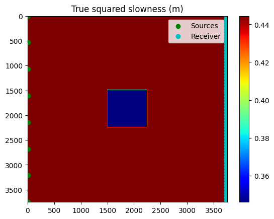
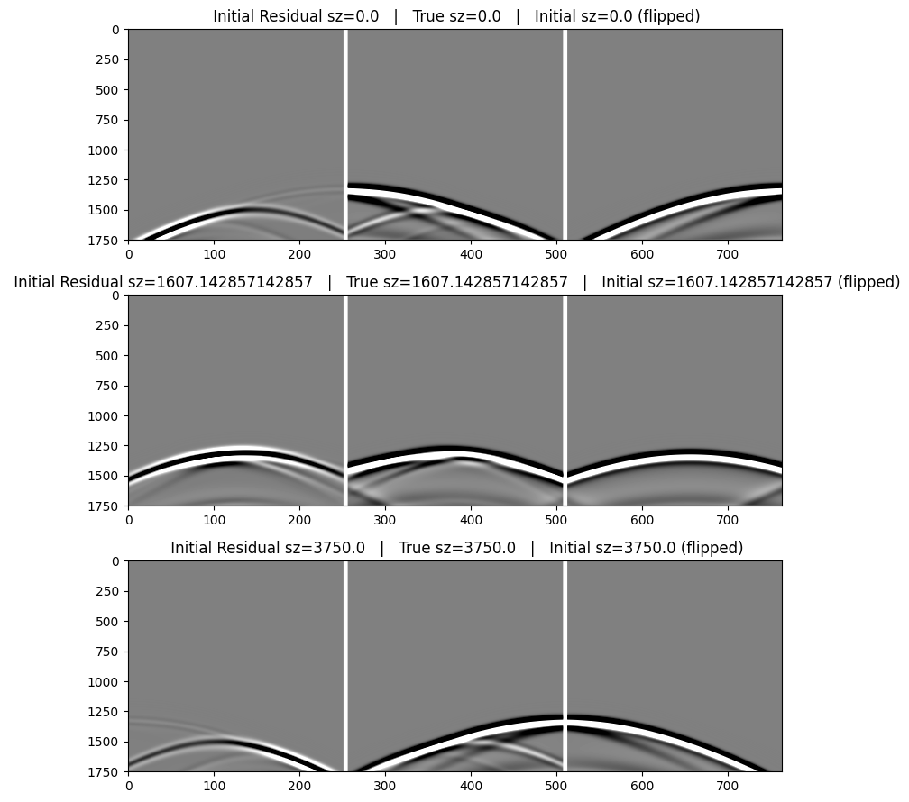
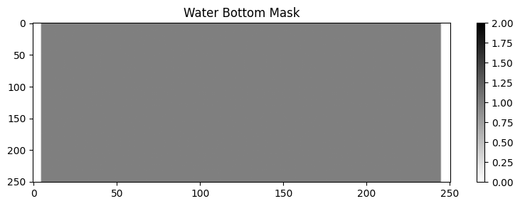
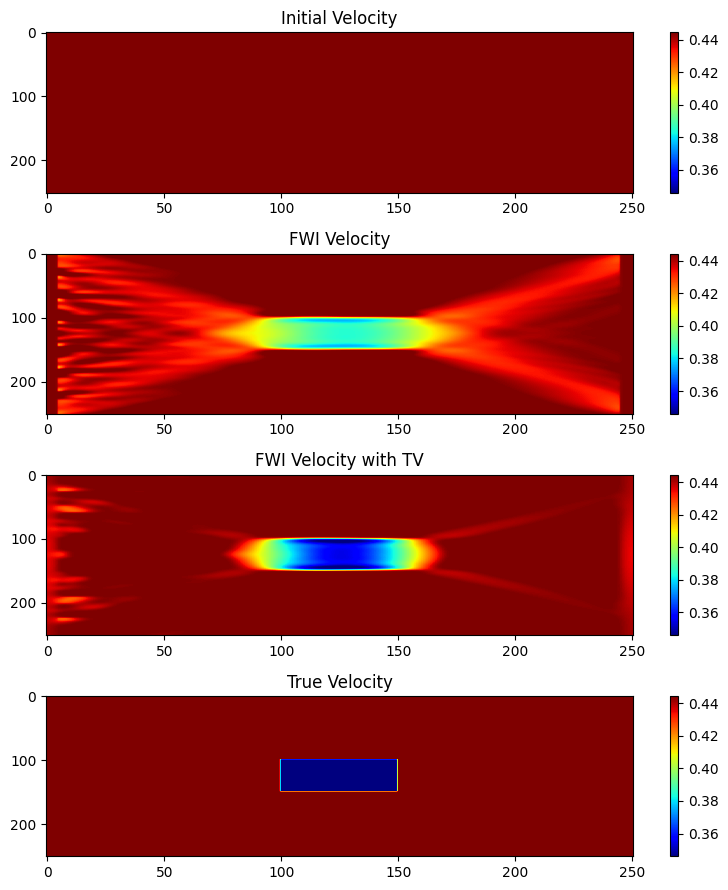

# Constrained FWI with

This tutorials demonstrates the use of constrains for FWI. The wave equation is performed with [JUDI](https://github.com/slimgroup/JUDI.jl) and the projections
wiht [SetIntersectionProjection](https://github.com/slimgroup/SetIntersectionProjection.jl).

#### Note on runtime
Warning: this notebook takes more than 1 hour to run for 16 shots with two workers on an Intel 8168.

`lscpu` CPU information: `Intel(R) Xeon(R) Platinum 8168 CPU @ 2.70GHz`


```julia
using SlimOptim
using Distributed, JUDI.TimeModeling, LinearAlgebra, PyPlot, SetIntersectionProjection, Printf
```

    ┌ Info: Precompiling SetIntersectionProjection [335f7d24-6316-57dd-9c3a-df470f2b739e]
    └ @ Base loading.jl:1278


## 1. Prepare models


```julia
n = (251, 251) # nx, nz
d = (15., 15.) # hx, hz
o = (0., 0.); # ox, oz
```


```julia
# Squared slowness
m = 1.5f0^(-2) * ones(Float32, n)
m[101:150, 101:150] .= 1.7f0^(-2)
m0 = 1/1.5^2 * ones(Float32, n);
```


```julia
model = Model(n,d,o,m)
model0 = Model(n,d,o,m0);
```

## Visualize


```julia
figure(figsize=(8,9))
vmin,vmax = extrema(m)
dmin,dmax = -.1,.1

subplot(3,1,1); imshow(m,aspect="auto",cmap="jet"); 
colorbar(); clim(vmin,vmax); title("True squared slowness (m)")

subplot(3,1,2); imshow(m0,aspect="auto",cmap="jet");
colorbar(); clim(vmin,vmax); title("Initial squared slowness (m0)");

subplot(3,1,3); imshow(m.-m0,aspect="auto",cmap="seismic");
colorbar(); clim(dmin,dmax); title("Difference (m-m0)");

tight_layout()
```


## 2. Setup Constraints with [SetIntersectionProjection](https://github.com/slimgroup/SetIntersectionProjection.jl)


```julia
options=PARSDMM_options()
options.FL=Float32
options=default_PARSDMM_options(options,options.FL)
constraint = Vector{SetIntersectionProjection.set_definitions}()
constraint2 = Vector{SetIntersectionProjection.set_definitions}()
```


    set_definitions[]


We setup two constaints:
- Bounds that limit maximum and minimum velocity
- TV, that limits variation and force a piece-wise constant structure


```julia
#bounds:
m_min = 0 .* m .+ minimum(m).*.5
m_max = 0 .* m .+ maximum(m)
set_type = "bounds"
TD_OP = "identity"
app_mode = ("matrix","")
custom_TD_OP = ([],false)
push!(constraint, set_definitions(set_type,TD_OP,vec(m_min),vec(m_max),app_mode,custom_TD_OP));
push!(constraint2, set_definitions(set_type,TD_OP,vec(m_min),vec(m_max),app_mode,custom_TD_OP));
```


```julia
#TV
(TV,dummy1,dummy2,dummy3) = get_TD_operator(model0,"TV",options.FL)
m_min = 0.0
m_max = norm(TV*vec(m),1) * .5
set_type = "l1"
TD_OP = "TV"
app_mode = ("matrix","")
custom_TD_OP = ([],false)
push!(constraint, set_definitions(set_type,TD_OP,m_min,m_max,app_mode,custom_TD_OP));
```


```julia
#set up constraints with bounds only, precompute some things and define projector
(P_sub2,TD_OP2,set_Prop2) = setup_constraints(constraint2, model0,options.FL)
(TD_OP2,AtA2,l2,y2) = PARSDMM_precompute_distribute(TD_OP2,set_Prop2,model0,options)
options2 = deepcopy(options)
options2.rho_ini = ones(length(TD_OP2))*10.0

proj_intersection2 = x-> PARSDMM(x, AtA2, TD_OP2, set_Prop2, P_sub2, model0, options2)  

# Projection function
function prj2(input)
    input = Float32.(input)
    (x,dummy1,dummy2,dymmy3) = proj_intersection2(vec(input))
    return x
end
```


    prj2 (generic function with 1 method)


```julia
#set up constraints with bounds and TV
(P_sub,TD_OP,set_Prop) = setup_constraints(constraint, model0,options.FL)
(TD_OP,AtA,l,y) = PARSDMM_precompute_distribute(TD_OP,set_Prop,model0,options)
options.rho_ini = ones(length(TD_OP))*10.0

proj_intersection = x-> PARSDMM(x, AtA, TD_OP, set_Prop, P_sub, model0, options)

# Projection function
function prj(input)
    input = Float32.(input)
    (x,dummy1,dummy2,dymmy3) = proj_intersection(vec(input))
    return x
end
```


    prj (generic function with 1 method)


## 3. Build a small local compute cluster (2 workers)

#### Setup OMP environment variables for the cluster

In the distributed compute case the workers that we add would be on different hardware, and we might add tens of workers in 2D and hundreds in 3D. Here we run on a single machine with only 2 workers, and so we need to be careful with details related to high performance computing. If we did not specify thread affinity, the two workers would compete for the same physical cores and the modeling would be *incredibly* slow.

We spin up the small 2-worker cluster by calling `addprocs(2)`, and because we set the environment variable `ENV["OMP_DISPLAY_ENV"] = "true"` we will see the OMP environment printed out on each worker. In that output (below) we can verify that half of the total threads (44/2 = 22) are assigned to each socket on this 2 socket system. You can obtain more details about the hardware with the shell command `lscpu`.

We set four environment variables related to OpenMP:
* `OMP_DISPLAY_ENV` prints out the OpenMP environment on each worker
* `OMP_PROC_BIND` specifies that threads should be bound to physical cores
* `OMP_NUM_THREADS` specifies the number of threads per workers is 1/2 the number of physical cores
* `GOMP_CPU_AFFINITY` specifies which physical cores the threads run on for each worker

If you run the shell command `top` during execution, you will see 3 julia processes: the main process and two workers. The two workers should generally have about 50% of the system, and `load average` should tend towards the physical number of cores.


```julia
nthread = Sys.CPU_THREADS
nw = 2

ENV["OMP_DISPLAY_ENV"] = "true"
ENV["OMP_PROC_BIND"] = "close"
ENV["OMP_NUM_THREADS"] = "$(div(nthread, nw))" 
addprocs(nw)
@show workers()
for k in 1:nworkers()
    place1 = (k - 1) * div(nthread,nworkers())
    place2 = (k + 0) * div(nthread,nworkers()) - 1
    @show place1, place2, div(nthread, nw)
    @spawnat workers()[k] ENV["GOMP_CPU_AFFINITY"] = "$(place1)-$(place2)";
end
```

    workers() = [2, 3]
    (place1, place2, div(nthread, nw)) = (0, 3, 4)
    (place1, place2, div(nthread, nw)) = (4, 7, 4)


```julia
@everywhere using Distributed, JUDI.TimeModeling, JUDI.SLIM_optim, LinearAlgebra, PyPlot, SetIntersectionProjection
```

          From worker 2:	
          From worker 2:	OPENMP DISPLAY ENVIRONMENT BEGIN
          From worker 2:	  _OPENMP = '201511'
          From worker 2:	  OMP_DYNAMIC = 'FALSE'
          From worker 2:	  OMP_NESTED = 'FALSE'
          From worker 2:	  OMP_NUM_THREADS = '4'
          From worker 2:	  OMP_SCHEDULE = 'DYNAMIC'
          From worker 2:	  OMP_PROC_BIND = 'CLOSE'
          From worker 2:	  OMP_PLACES = '{0},{1},{2},{3}'
          From worker 2:	  OMP_STACKSIZE = '0'
          From worker 2:	  OMP_WAIT_POLICY = 'PASSIVE'
          From worker 2:	  OMP_THREAD_LIMIT = '4294967295'
          From worker 2:	  OMP_MAX_ACTIVE_LEVELS = '2147483647'
          From worker 2:	  OMP_CANCELLATION = 'FALSE'
          From worker 2:	  OMP_DEFAULT_DEVICE = '0'
          From worker 2:	  OMP_MAX_TASK_PRIORITY = '0'
          From worker 2:	  OMP_DISPLAY_AFFINITY = 'FALSE'
          From worker 2:	  OMP_AFFINITY_FORMAT = 'level %L thread %i affinity %A'
          From worker 2:	OPENMP DISPLAY ENVIRONMENT END
          From worker 3:	
          From worker 3:	OPENMP DISPLAY ENVIRONMENT BEGIN
          From worker 3:	  _OPENMP = '201511'
          From worker 3:	  OMP_DYNAMIC = 'FALSE'
          From worker 3:	  OMP_NESTED = 'FALSE'
          From worker 3:	  OMP_NUM_THREADS = '4'
          From worker 3:	  OMP_SCHEDULE = 'DYNAMIC'
          From worker 3:	  OMP_PROC_BIND = 'CLOSE'
          From worker 3:	  OMP_PLACES = '{4},{5},{6},{7}'
          From worker 3:	  OMP_STACKSIZE = '0'
          From worker 3:	  OMP_WAIT_POLICY = 'PASSIVE'
          From worker 3:	  OMP_THREAD_LIMIT = '4294967295'
          From worker 3:	  OMP_MAX_ACTIVE_LEVELS = '2147483647'
          From worker 3:	  OMP_CANCELLATION = 'FALSE'
          From worker 3:	  OMP_DEFAULT_DEVICE = '0'
          From worker 3:	  OMP_MAX_TASK_PRIORITY = '0'
          From worker 3:	  OMP_DISPLAY_AFFINITY = 'FALSE'
          From worker 3:	  OMP_AFFINITY_FORMAT = 'level %L thread %i affinity %A'
          From worker 3:	OPENMP DISPLAY ENVIRONMENT END
          From worker 2:	
          From worker 2:	OPENMP DISPLAY ENVIRONMENT BEGIN
          From worker 2:	  _OPENMP = '201511'
          From worker 2:	  OMP_DYNAMIC = 'FALSE'
          From worker 2:	  OMP_NESTED = 'FALSE'
          From worker 2:	  OMP_NUM_THREADS = '4'
          From worker 2:	  OMP_SCHEDULE = 'DYNAMIC'
          From worker 2:	  OMP_PROC_BIND = 'CLOSE'
          From worker 2:	  OMP_PLACES = '{0},{1},{2},{3}'
          From worker 2:	  OMP_STACKSIZE = '0'
          From worker 2:	  OMP_WAIT_POLICY = 'PASSIVE'
          From worker 2:	  OMP_THREAD_LIMIT = '4294967295'
          From worker 2:	  OMP_MAX_ACTIVE_LEVELS = '2147483647'
          From worker 2:	  OMP_CANCELLATION = 'FALSE'
          From worker 2:	  OMP_DEFAULT_DEVICE = '0'
          From worker 2:	  OMP_MAX_TASK_PRIORITY = '0'
          From worker 2:	  OMP_DISPLAY_AFFINITY = 'FALSE'
          From worker 2:	  OMP_AFFINITY_FORMAT = 'level %L thread %i affinity %A'
          From worker 2:	OPENMP DISPLAY ENVIRONMENT END
          From worker 3:	
          From worker 3:	OPENMP DISPLAY ENVIRONMENT BEGIN
          From worker 3:	  _OPENMP = '201511'
          From worker 3:	  OMP_DYNAMIC = 'FALSE'
          From worker 3:	  OMP_NESTED = 'FALSE'
          From worker 3:	  OMP_NUM_THREADS = '4'
          From worker 3:	  OMP_SCHEDULE = 'DYNAMIC'
          From worker 3:	  OMP_PROC_BIND = 'CLOSE'
          From worker 3:	  OMP_PLACES = '{4},{5},{6},{7}'
          From worker 3:	  OMP_STACKSIZE = '0'
          From worker 3:	  OMP_WAIT_POLICY = 'PASSIVE'
          From worker 3:	  OMP_THREAD_LIMIT = '4294967295'
          From worker 3:	  OMP_MAX_ACTIVE_LEVELS = '2147483647'
          From worker 3:	  OMP_CANCELLATION = 'FALSE'
          From worker 3:	  OMP_DEFAULT_DEVICE = '0'
          From worker 3:	  OMP_MAX_TASK_PRIORITY = '0'
          From worker 3:	  OMP_DISPLAY_AFFINITY = 'FALSE'
          From worker 3:	  OMP_AFFINITY_FORMAT = 'level %L thread %i affinity %A'
          From worker 3:	OPENMP DISPLAY ENVIRONMENT END


## 4. Create source and receivers geometries
We use 8 shot locations evenly distributed across the left of the model.


```julia
tn = 3500  # Recording time in ms
dt = 2f0  # Shot record sampling rate in ms
f0 = 0.005 # Peak frquency in kHz
```


    0.005


```julia
nsrc = 8
xsrc = convertToCell(d[1].*ones(Float32, nsrc))
ysrc = convertToCell(range(0f0, stop = 0f0, length = nsrc))
zsrc = convertToCell(range(0f0, (n[2] - 1)*d[2], length=nsrc))
src_geom = Geometry(xsrc, ysrc, zsrc; dt=dt, t=tn);
```


```julia
nrec = 251
xrec = (n[1] - 2)*d[1] .* ones(Float32, nrec)
yrec = 0f0
zrec = convertToCell(range(0f0, (n[2] - 1)*d[2], length=nrec))
rec_geom = Geometry(xrec, yrec, zrec; dt=dt, t=tn, nsrc=nsrc);
```

#### Visualize geometry


```julia
figure()
vmin,vmax = extrema(m)
dmin,dmax = -.1,.1

imshow(m,aspect="auto",cmap="jet", extent=[0, 3750, 3750, 0]); 
colorbar(); clim(vmin,vmax); title("True squared slowness (m)")
scatter(xsrc, zsrc, c="g", label="Sources")
scatter(xrec[1:4:end], zrec[1:4:end], c="c", label="Receiver")
legend()
```





    PyObject <matplotlib.legend.Legend object at 0x7f90626162b0>


## 5. Build `F`, the JUDI modeling operator


```julia
# True model operator
ntComp = get_computational_nt(src_geom, rec_geom, model)
info = Info(prod(n), nsrc, ntComp)
F = judiModeling(info, model, src_geom, rec_geom)

# Intial model operator
ntComp = get_computational_nt(src_geom, rec_geom, model0)
info = Info(prod(n), nsrc,ntComp)
F0 = judiModeling(info, model0, src_geom, rec_geom);
```


```julia
# Source function
fsrc = judiVector(src_geom, ricker_wavelet(tn, dt, f0));
```

## 6. Use `F` to create the data in both models


```julia
t1 = @elapsed begin
    dobs = F*fsrc;
end
@info @sprintf("Time in true model; %.2f seconds\n", t1);

t2 = @elapsed begin
    d0 = F0*fsrc;
end
@info @sprintf("Time in init model; %.2f seconds\n", t2);
```

    ┌ Info: Time in true model; 17.57 seconds
    └ @ Main In[20]:4
    ┌ Info: Time in init model; 6.78 seconds
    └ @ Main In[20]:9


#### Compute the residual data


```julia
r = d0 - dobs;
```

## 7. Visualize data


```julia
shots = [1,4,8]
```


    3-element Array{Int64,1}:
     1
     4
     8


#### Plot shot gathers for true model, initial model, and residual

The table below describes the data images below. We flip the direction of the residual and modeled data in order to help display the match with the true data.

```@raw html
<table style="border:1px solid black;" width="60%">
<tr>
  <td style="border:1px solid black; text-align:center;" bgcolor="white">
      <b>Initial Residual Data<br>(flipped)</b></td>
  <td style="border:1px solid black; text-align:center;" bgcolor="white">
      <b>True Data</b></td>
  <td style="border:1px solid black; text-align:center;" bgcolor="white">
      <b>Initial Data<br>(flipped)</b></td>
</tr>
</table>
```

Note that the data modeled in the initial model lacks a lot of reflectivity that is evident in the data modeled in the true model. We expect to recover this missing reflectivity with the FWI.


```julia
scale = 10.0 / sqrt(norm(dobs)^2 / length(dobs.data))
@show scale

nzero = 5
pad = ones(Float32,1751,nzero)

figure(figsize=(8,9)); clf()
for (iplot,ishot) in enumerate(shots)
    cat2 = hcat(reverse(r.data[ishot],dims=2), pad, dobs.data[ishot], pad, reverse(d0.data[ishot],dims=2))
    subplot(3,1,iplot);
    imshow(cat2,cmap="gray",aspect="auto",clim=[-1,+1]);
    title(" Initial Residual sz=$(zsrc[ishot])   |   True sz=$(zsrc[ishot])   |   Initial sz=$(zsrc[ishot]) (flipped)");
end
tight_layout()
```





    scale = 0.01818860621034772


## 8. Assess if data is cycle skipped at the farthest offsets
Next we plot the far offset traces for these three shots in order to assess if the data is cycle skipped. 

You can ovbserve in the plots below that the refraction waveforms (first arrivals) in the initial model are not cycle skipped with respect to the true model, so we can proceed. 

A very significant part of the residual wavefield is actually reflections in this example.


```julia
scale = 10.0 / sqrt(norm(dobs)^2 / length(dobs.data))
t = [0.0:dt:tn;]

figure(figsize=(8,9)); clf()
for (iplot,ishot) in enumerate(shots)
    subplot(3,1,iplot);
    plot(t,dobs.data[ishot][:,end],label="True Model $(ishot) at z=$(zsrc[ishot])");
    plot(t,d0.data[ishot][:,end],label="Initial Model $(ishot) at z=$(zsrc[ishot])");
    xlim([4.5,t[end]])
    legend()
end
tight_layout()
```


## 9. Build the `objective` functions

#### Build src/rec positions mask
We use this mask to remove the imprint in gradients of proximity to source locations. The mask is set to 0 wherever a source or receiver is close, and is set to 1 otherwise. Without this mask most of the gradient updates would be concentrated close to sources where the model is correct. 


```julia
wb_mask = ones(Float32,size(m))
wb_mask[1:5, :] .= 0;
wb_mask[end-5:end, :] .= 0;

figure(figsize=(8,3))
imshow(wb_mask', aspect="auto",cmap="gray_r",clim=[0,+2]);
colorbar();
title("Water Bottom Mask");
tight_layout()
```





#### Build the `objective` function
This method is called by the solver whenever the gradient is required. Steps in computing the gradient are as follows:
1. Apply the adjoint of the Jacobian to the current residual `J' * [F*v - d]` 
1. Apply simple scaling based on the size of the first gradient, and save to apply to future gradients


```julia
# build Jacoian
J = judiJacobian(F0, fsrc)

function objective(F0, G, m, dobs, wb_mask)
    F0.model.m .= m
    t = @elapsed begin
        d0 = F0*fsrc
        G = J' * (d0 .- dobs)
    end
    G .*= wb_mask
    ϕ = .5*norm(d0 .- dobs)^2
    if gscale == 0.0
        # compute scalar from first gradient, apply to future gradients
        global gscale = .25 ./ maximum(G) 
        @show gscale
    end
    G .*= gscale
    return ϕ, vec(G.data)
end

# struct to save the first gradient scalar
gscale = 0f0
g(x) = objective(F0, x, dobs, wb_mask)
```


    g (generic function with 1 method)


#### Compute gradient


```julia
tgrad1 = @elapsed begin
    grad1 = objective(F0, vec(m0), dobs, wb_mask)[2]
    gscale = 0
end
@show tgrad1;
```

    gscale = 3.164575347982762e-5
    tgrad1 = 20.692245796


```julia
dm = m0 .- m
grad1 = reshape(grad1, n)
mg2 = reshape(m0 .- grad1, n)
figure(figsize=(8,9))

subplot(5,1,1)
imshow(grad1' ./ maximum(abs,grad1),aspect="auto",cmap="seismic");
colorbar(orientation="vertical");clim(-1,1);
title("Initial Gradient without Illumination Compensation");

subplot(5,1,2)
imshow(dm ./ maximum(abs,dm),aspect="auto",cmap="seismic");
colorbar(orientation="vertical");clim(-1,1);
title("Squared slowness Difference: (m0 - m)");

subplot(5,1,3)
imshow(mg2',aspect="auto",cmap="seismic");
colorbar(orientation="vertical");clim(vmin,vmax)
title("Updated squared slowness: (m0 - grad1)");

subplot(5,1,4)
imshow(reshape(prj(mg2), n)',aspect="auto",cmap="seismic");
colorbar(orientation="vertical");clim(vmin,vmax)
title("Updated projected (bounds + TV) squared slowness: prj(m0 - grad1)");

subplot(5,1,5)
imshow(reshape(prj2(mg2), n)',aspect="auto",cmap="seismic");
colorbar(orientation="vertical");clim(vmin,vmax)
title("Updated projected (bounds) squared slowness: prj(m0 - grad1)");

tight_layout()
```

    relative evolution to small, exiting PARSDMM (iteration 36)


    Hello
    input to PARSDMM is feasible, returning


## 10. Perform the FWI using `minConf_PQN`
We will do 10 functions evaluation cost of projected quasi-Newton with two setup:
- Bounds constraints only
- Bounds + tv constrains


```julia
# FWI with PQN
niter = 10
gscale = 0f0
options_pqn = pqn_options(progTol=0, store_trace=true, verbose=3, maxIter=niter)
```


    JUDI.SLIM_optim.PQN_params(3, 1.0f-5, 0, 10, 0.0001f0, 10, false, false, true, 1.0f-6, 1.0f-7, 10, false, 20)


```julia
sol = pqn(g, vec(m0), prj, options_pqn);
```

    Running PQN...
    Number of L-BFGS Corrections to store: 10
    Spectral initialization of SPG: 0
    Maximum number of SPG iterations: 10
    SPG optimality tolerance: 1.00e-06
    SPG progress tolerance: 1.00e-07
    PQN optimality tolerance: 1.00e-05
    PQN progress tolerance: 0.00e+00
    Quadratic initialization of line search: 0
    Maximum number of function evaluations: 10
    input to PARSDMM is feasible, returning
    gscale = 3.164575347982762e-5
     Iteration   FunEvals Projections     Step Length    Function Val        Opt Cond
    relative evolution to small, exiting PARSDMM (iteration 36)
             0          0          0     0.00000e+00     7.56888e+05     6.44959e-02
    relative evolution to small, exiting PARSDMM (iteration 36)
    relative evolution to small, exiting PARSDMM (iteration 36)
    Cubic Backtracking
    Cubic Backtracking
    0.29970267128723044, (63001,)0.5874509773710214
    relative evolution to small, exiting PARSDMM (iteration 31)
             1          4          5     2.74241e-01     4.56943e+05     2.89910e-02
    relative evolution to small, exiting PARSDMM (iteration 31)
    relative evolution to small, exiting PARSDMM (iteration 15)
    relative evolution to small, exiting PARSDMM (iteration 15)
    relative evolution to small, exiting PARSDMM (iteration 15)
    relative evolution to small, exiting PARSDMM (iteration 15)
    relative evolution to small, exiting PARSDMM (iteration 15)
    relative evolution to small, exiting PARSDMM (iteration 15)
    relative evolution to small, exiting PARSDMM (iteration 15)
    relative evolution to small, exiting PARSDMM (iteration 15)
    relative evolution to small, exiting PARSDMM (iteration 15)
    relative evolution to small, exiting PARSDMM (iteration 15)
    relative evolution to small, exiting PARSDMM (iteration 15)
    relative evolution to small, exiting PARSDMM (iteration 15)
    relative evolution to small, exiting PARSDMM (iteration 15)
    0.3645347021520138, (63001,)0.5415892004966736
    relative evolution to small, exiting PARSDMM (iteration 26)
             2          5         20     1.00000e+00     1.96831e+05     2.17257e-02
    relative evolution to small, exiting PARSDMM (iteration 26)
    relative evolution to small, exiting PARSDMM (iteration 15)
    relative evolution to small, exiting PARSDMM (iteration 24)
    relative evolution to small, exiting PARSDMM (iteration 15)
    relative evolution to small, exiting PARSDMM (iteration 23)
    relative evolution to small, exiting PARSDMM (iteration 15)
    relative evolution to small, exiting PARSDMM (iteration 15)
    relative evolution to small, exiting PARSDMM (iteration 15)
    relative evolution to small, exiting PARSDMM (iteration 23)
    relative evolution to small, exiting PARSDMM (iteration 15)
    relative evolution to small, exiting PARSDMM (iteration 23)
    relative evolution to small, exiting PARSDMM (iteration 15)
    relative evolution to small, exiting PARSDMM (iteration 15)
    relative evolution to small, exiting PARSDMM (iteration 15)
    0.35030123218894005, (63001,)0.4920957423746586
    relative evolution to small, exiting PARSDMM (iteration 27)
             3          6         35     1.00000e+00     8.08809e+04     2.08072e-02
    relative evolution to small, exiting PARSDMM (iteration 27)
    relative evolution to small, exiting PARSDMM (iteration 15)
    relative evolution to small, exiting PARSDMM (iteration 26)
    relative evolution to small, exiting PARSDMM (iteration 15)
    relative evolution to small, exiting PARSDMM (iteration 25)
    relative evolution to small, exiting PARSDMM (iteration 15)
    relative evolution to small, exiting PARSDMM (iteration 25)
    relative evolution to small, exiting PARSDMM (iteration 15)
    relative evolution to small, exiting PARSDMM (iteration 25)
    relative evolution to small, exiting PARSDMM (iteration 15)
    relative evolution to small, exiting PARSDMM (iteration 25)
    relative evolution to small, exiting PARSDMM (iteration 15)
    relative evolution to small, exiting PARSDMM (iteration 25)
    relative evolution to small, exiting PARSDMM (iteration 15)
    relative evolution to small, exiting PARSDMM (iteration 25)
    relative evolution to small, exiting PARSDMM (iteration 15)
    0.3626699335873127, (63001,)0.4909360632300377
    relative evolution to small, exiting PARSDMM (iteration 24)
             4          7         52     1.00000e+00     4.65027e+04     2.76750e-02
    relative evolution to small, exiting PARSDMM (iteration 24)
    relative evolution to small, exiting PARSDMM (iteration 15)
    relative evolution to small, exiting PARSDMM (iteration 25)
    relative evolution to small, exiting PARSDMM (iteration 15)
    relative evolution to small, exiting PARSDMM (iteration 24)
    relative evolution to small, exiting PARSDMM (iteration 14)
    relative evolution to small, exiting PARSDMM (iteration 24)
    relative evolution to small, exiting PARSDMM (iteration 14)
    relative evolution to small, exiting PARSDMM (iteration 25)
    relative evolution to small, exiting PARSDMM (iteration 15)
    relative evolution to small, exiting PARSDMM (iteration 24)
    relative evolution to small, exiting PARSDMM (iteration 15)
    0.358932975679636, (63001,)0.478837039321661
    relative evolution to small, exiting PARSDMM (iteration 14)
             5          8         65     1.00000e+00     3.00094e+04     2.34035e-02
    relative evolution to small, exiting PARSDMM (iteration 14)
    relative evolution to small, exiting PARSDMM (iteration 15)
    relative evolution to small, exiting PARSDMM (iteration 23)
    relative evolution to small, exiting PARSDMM (iteration 15)
    relative evolution to small, exiting PARSDMM (iteration 27)
    relative evolution to small, exiting PARSDMM (iteration 27)
    0.3501978628337383, (63001,)0.4665626771748066
    relative evolution to small, exiting PARSDMM (iteration 14)
             6          9         72     1.00000e+00     1.73936e+04     2.05345e-02
    relative evolution to small, exiting PARSDMM (iteration 14)
    relative evolution to small, exiting PARSDMM (iteration 15)
    relative evolution to small, exiting PARSDMM (iteration 14)
    relative evolution to small, exiting PARSDMM (iteration 15)
    relative evolution to small, exiting PARSDMM (iteration 26)
    relative evolution to small, exiting PARSDMM (iteration 15)
    0.34992028027772903, (63001,)0.46518728509545326
    relative evolution to small, exiting PARSDMM (iteration 14)
             7         10         79     1.00000e+00     1.26443e+04     1.34957e-02
    relative evolution to small, exiting PARSDMM (iteration 14)
    relative evolution to small, exiting PARSDMM (iteration 14)
    relative evolution to small, exiting PARSDMM (iteration 14)
    relative evolution to small, exiting PARSDMM (iteration 15)
    relative evolution to small, exiting PARSDMM (iteration 14)
    relative evolution to small, exiting PARSDMM (iteration 15)
    relative evolution to small, exiting PARSDMM (iteration 14)
    relative evolution to small, exiting PARSDMM (iteration 15)
    relative evolution to small, exiting PARSDMM (iteration 14)
    relative evolution to small, exiting PARSDMM (iteration 15)
    relative evolution to small, exiting PARSDMM (iteration 14)
    relative evolution to small, exiting PARSDMM (iteration 14)
    relative evolution to small, exiting PARSDMM (iteration 14)
    relative evolution to small, exiting PARSDMM (iteration 14)
    relative evolution to small, exiting PARSDMM (iteration 14)
    relative evolution to small, exiting PARSDMM (iteration 14)
    relative evolution to small, exiting PARSDMM (iteration 14)
    relative evolution to small, exiting PARSDMM (iteration 15)
    0.34455902641639113, (63001,)0.4601459242403507
    relative evolution to small, exiting PARSDMM (iteration 14)
             8         11         98     1.00000e+00     6.46003e+03     8.41045e-03
    relative evolution to small, exiting PARSDMM (iteration 14)
    relative evolution to small, exiting PARSDMM (iteration 14)
    relative evolution to small, exiting PARSDMM (iteration 14)
    relative evolution to small, exiting PARSDMM (iteration 15)
    relative evolution to small, exiting PARSDMM (iteration 14)
    relative evolution to small, exiting PARSDMM (iteration 15)
    relative evolution to small, exiting PARSDMM (iteration 14)
    relative evolution to small, exiting PARSDMM (iteration 15)
    relative evolution to small, exiting PARSDMM (iteration 14)
    relative evolution to small, exiting PARSDMM (iteration 14)
    relative evolution to small, exiting PARSDMM (iteration 14)
    relative evolution to small, exiting PARSDMM (iteration 14)
    0.3416639202623628, (63001,)0.45731245446950197
    relative evolution to small, exiting PARSDMM (iteration 14)
             9         12        111     1.00000e+00     4.24626e+03     6.41516e-03
    relative evolution to small, exiting PARSDMM (iteration 14)
    relative evolution to small, exiting PARSDMM (iteration 15)
    relative evolution to small, exiting PARSDMM (iteration 14)
    relative evolution to small, exiting PARSDMM (iteration 15)
    relative evolution to small, exiting PARSDMM (iteration 14)
    relative evolution to small, exiting PARSDMM (iteration 15)
    relative evolution to small, exiting PARSDMM (iteration 14)
    relative evolution to small, exiting PARSDMM (iteration 15)
    relative evolution to small, exiting PARSDMM (iteration 14)
    relative evolution to small, exiting PARSDMM (iteration 15)
    0.3406056523381267, (63001,)0.45664693508297205
    relative evolution to small, exiting PARSDMM (iteration 14)
            10         13        122     1.00000e+00     3.47106e+03     5.40122e-03


```julia
sol2 = minConf_PQN(g, vec(m0), prj2, options_pqn);
```

    Running PQN...
    Number of L-BFGS Corrections to store: 10
    Spectral initialization of SPG: 0
    Maximum number of SPG iterations: 10
    SPG optimality tolerance: 1.00e-06
    SPG progress tolerance: 1.00e-07
    PQN optimality tolerance: 1.00e-05
    PQN progress tolerance: 0.00e+00
    Quadratic initialization of line search: 0
    Maximum number of function evaluations: 10
    input to PARSDMM is feasible, returning
     Iteration   FunEvals Projections     Step Length    Function Val        Opt Cond
    input to PARSDMM is feasible, returning
             0          0          0     0.00000e+00     7.56888e+05     2.50000e-01
    input to PARSDMM is feasible, returning
    input to PARSDMM is feasible, returning
    Cubic Backtracking
    0.37986092867546234, (63001,)0.6480796155205198
    relative evolution to small, exiting PARSDMM (iteration 15)
             1          3          5     3.54968e-01     5.06750e+05     8.41055e-02
    relative evolution to small, exiting PARSDMM (iteration 15)
    input to PARSDMM is feasible, returning
    input to PARSDMM is feasible, returning
    input to PARSDMM is feasible, returning
    input to PARSDMM is feasible, returning
    input to PARSDMM is feasible, returning
    input to PARSDMM is feasible, returning
    input to PARSDMM is feasible, returning
    input to PARSDMM is feasible, returning
    input to PARSDMM is feasible, returning
    input to PARSDMM is feasible, returning
    input to PARSDMM is feasible, returning
    input to PARSDMM is feasible, returning
    input to PARSDMM is feasible, returning
    input to PARSDMM is feasible, returning
    input to PARSDMM is feasible, returning
    input to PARSDMM is feasible, returning
    input to PARSDMM is feasible, returning
    0.35521354526281357, (63001,)0.5054220408201218
    input to PARSDMM is feasible, returning
             2          4         24     1.00000e+00     1.11358e+05     5.56206e-02
    input to PARSDMM is feasible, returning
    input to PARSDMM is feasible, returning
    input to PARSDMM is feasible, returning
    input to PARSDMM is feasible, returning
    input to PARSDMM is feasible, returning
    input to PARSDMM is feasible, returning
    input to PARSDMM is feasible, returning
    input to PARSDMM is feasible, returning
    input to PARSDMM is feasible, returning
    input to PARSDMM is feasible, returning
    input to PARSDMM is feasible, returning
    input to PARSDMM is feasible, returning
    input to PARSDMM is feasible, returning
    input to PARSDMM is feasible, returning
    0.3701881654560566, (63001,)0.4869217425584793
    input to PARSDMM is feasible, returning
             3          5         39     1.00000e+00     6.61499e+04     4.28273e-02
    input to PARSDMM is feasible, returning
    input to PARSDMM is feasible, returning
    input to PARSDMM is feasible, returning
    input to PARSDMM is feasible, returning
    input to PARSDMM is feasible, returning
    input to PARSDMM is feasible, returning
    input to PARSDMM is feasible, returning
    input to PARSDMM is feasible, returning
    input to PARSDMM is feasible, returning
    input to PARSDMM is feasible, returning
    input to PARSDMM is feasible, returning
    input to PARSDMM is feasible, returning
    input to PARSDMM is feasible, returning
    input to PARSDMM is feasible, returning
    input to PARSDMM is feasible, returning
    input to PARSDMM is feasible, returning
    input to PARSDMM is feasible, returning
    input to PARSDMM is feasible, returning
    input to PARSDMM is feasible, returning
    0.373028289526701, (63001,)0.47711528558284044
    input to PARSDMM is feasible, returning
             4          6         59     1.00000e+00     2.60822e+04     2.62599e-02
    input to PARSDMM is feasible, returning
    input to PARSDMM is feasible, returning
    input to PARSDMM is feasible, returning
    input to PARSDMM is feasible, returning
    input to PARSDMM is feasible, returning
    input to PARSDMM is feasible, returning
    input to PARSDMM is feasible, returning
    input to PARSDMM is feasible, returning
    input to PARSDMM is feasible, returning
    input to PARSDMM is feasible, returning
    input to PARSDMM is feasible, returning
    input to PARSDMM is feasible, returning
    input to PARSDMM is feasible, returning
    input to PARSDMM is feasible, returning
    input to PARSDMM is feasible, returning
    input to PARSDMM is feasible, returning
    input to PARSDMM is feasible, returning
    input to PARSDMM is feasible, returning
    input to PARSDMM is feasible, returning
    0.379634543787688, (63001,)0.4776479071006179
    input to PARSDMM is feasible, returning
             5          7         79     1.00000e+00     1.40333e+04     2.08746e-02
    input to PARSDMM is feasible, returning
    input to PARSDMM is feasible, returning
    input to PARSDMM is feasible, returning
    input to PARSDMM is feasible, returning
    input to PARSDMM is feasible, returning
    input to PARSDMM is feasible, returning
    input to PARSDMM is feasible, returning
    input to PARSDMM is feasible, returning
    input to PARSDMM is feasible, returning
    input to PARSDMM is feasible, returning
    input to PARSDMM is feasible, returning
    input to PARSDMM is feasible, returning
    input to PARSDMM is feasible, returning
    input to PARSDMM is feasible, returning
    input to PARSDMM is feasible, returning
    input to PARSDMM is feasible, returning
    input to PARSDMM is feasible, returning
    input to PARSDMM is feasible, returning
    input to PARSDMM is feasible, returning
    0.3758693804265931, (63001,)0.4798321803100407
    input to PARSDMM is feasible, returning
             6          8         99     1.00000e+00     5.61614e+03     9.52557e-03
    input to PARSDMM is feasible, returning
    input to PARSDMM is feasible, returning
    input to PARSDMM is feasible, returning
    input to PARSDMM is feasible, returning
    input to PARSDMM is feasible, returning
    input to PARSDMM is feasible, returning
    input to PARSDMM is feasible, returning
    input to PARSDMM is feasible, returning
    input to PARSDMM is feasible, returning
    input to PARSDMM is feasible, returning
    input to PARSDMM is feasible, returning
    input to PARSDMM is feasible, returning
    input to PARSDMM is feasible, returning
    input to PARSDMM is feasible, returning
    input to PARSDMM is feasible, returning
    input to PARSDMM is feasible, returning
    input to PARSDMM is feasible, returning
    input to PARSDMM is feasible, returning
    input to PARSDMM is feasible, returning
    0.377302254550159, (63001,)0.483893642667681
    input to PARSDMM is feasible, returning
             7          9        119     1.00000e+00     3.39727e+03     9.15307e-03
    input to PARSDMM is feasible, returning
    input to PARSDMM is feasible, returning
    input to PARSDMM is feasible, returning
    input to PARSDMM is feasible, returning
    input to PARSDMM is feasible, returning
    input to PARSDMM is feasible, returning
    input to PARSDMM is feasible, returning
    input to PARSDMM is feasible, returning
    input to PARSDMM is feasible, returning
    input to PARSDMM is feasible, returning
    input to PARSDMM is feasible, returning
    input to PARSDMM is feasible, returning
    input to PARSDMM is feasible, returning
    input to PARSDMM is feasible, returning
    input to PARSDMM is feasible, returning
    input to PARSDMM is feasible, returning
    input to PARSDMM is feasible, returning
    input to PARSDMM is feasible, returning
    input to PARSDMM is feasible, returning
    0.3752191723906435, (63001,)0.48195909010246396
    input to PARSDMM is feasible, returning
             8         10        139     1.00000e+00     2.48762e+03     6.99520e-03
    input to PARSDMM is feasible, returning
    input to PARSDMM is feasible, returning
    input to PARSDMM is feasible, returning
    input to PARSDMM is feasible, returning
    input to PARSDMM is feasible, returning
    input to PARSDMM is feasible, returning
    input to PARSDMM is feasible, returning
    input to PARSDMM is feasible, returning
    input to PARSDMM is feasible, returning
    input to PARSDMM is feasible, returning
    input to PARSDMM is feasible, returning
    input to PARSDMM is feasible, returning
    input to PARSDMM is feasible, returning
    input to PARSDMM is feasible, returning
    input to PARSDMM is feasible, returning
    input to PARSDMM is feasible, returning
    input to PARSDMM is feasible, returning
    input to PARSDMM is feasible, returning
    input to PARSDMM is feasible, returning
    0.37440903729293495, (63001,)0.4817936853505671
    input to PARSDMM is feasible, returning
             9         11        159     1.00000e+00     1.94118e+03     5.18629e-03
    input to PARSDMM is feasible, returning
    input to PARSDMM is feasible, returning
    input to PARSDMM is feasible, returning
    input to PARSDMM is feasible, returning
    input to PARSDMM is feasible, returning
    input to PARSDMM is feasible, returning
    input to PARSDMM is feasible, returning
    input to PARSDMM is feasible, returning
    input to PARSDMM is feasible, returning
    input to PARSDMM is feasible, returning
    input to PARSDMM is feasible, returning
    input to PARSDMM is feasible, returning
    input to PARSDMM is feasible, returning
    input to PARSDMM is feasible, returning
    input to PARSDMM is feasible, returning
    input to PARSDMM is feasible, returning
    input to PARSDMM is feasible, returning
    input to PARSDMM is feasible, returning
    input to PARSDMM is feasible, returning
    0.372569696046412, (63001,)0.48126206363667734
    input to PARSDMM is feasible, returning
            10         12        179     1.00000e+00     1.38128e+03     5.06586e-03


```julia
mf = reshape(prj(sol.sol), n) # optimal solution
ϕ = sol.f_trace   # cost vs iteration
m1 = sol.x_trace  # model vs iteration
collect(m1[i] = reshape(m1[i], n) for i=1:length(ϕ));
```

    relative evolution to small, exiting PARSDMM (iteration 15)


```julia
mf2 = reshape(prj(sol2.sol), n) # optimal solution
ϕ2 = sol2.f_trace   # cost vs iteration
m2 = sol2.x_trace  # model vs iteration
collect(m2[i] = reshape(m2[i], n) for i=1:length(ϕ2));
```

    relative evolution to small, exiting PARSDMM (iteration 15)


## 11. Visualize velocity models and objective function


```julia
figure(figsize=(8,9)); clf()

subplot(4,1,1);imshow(m0',aspect="auto",cmap="jet");
colorbar(orientation="vertical");clim(vmin,vmax);title("Initial Velocity");

subplot(4,1,2);imshow(mf2',aspect="auto",cmap="jet");
colorbar(orientation="vertical");clim(vmin,vmax);title("FWI Velocity");

subplot(4,1,3);imshow(mf',aspect="auto",cmap="jet");
colorbar(orientation="vertical");clim(vmin,vmax);title("FWI Velocity with TV");

subplot(4,1,4);imshow(m',aspect="auto",cmap="jet");
colorbar(orientation="vertical");clim(vmin,vmax);title("True Velocity")

tight_layout()
```





#### Display the velocity difference models 


```julia
rms_v2 = @sprintf("%.1f m/s", sqrt(norm(m .- m0)^2 / length(m)))
rms_vf = @sprintf("%.1f m/s", sqrt(norm(m .- mf)^2 / length(m)))
rms_vf2 = @sprintf("%.1f m/s", sqrt(norm(m .- mf2)^2 / length(m)))

figure(figsize=(8,6)); clf()

subplot(3,1,1);imshow(m .- m0,aspect="auto",cmap="seismic");
colorbar(orientation="vertical");clim(dmin,dmax);
title("Vtrue - Vinit difference, rms=$(rms_v2)");

subplot(3,1,2);imshow(m .- mf,aspect="auto",cmap="seismic");
colorbar(orientation="vertical");clim(dmin,dmax);
title("Vtrue - Vfwi difference, rms=$(rms_vf)");

subplot(3,1,3);imshow(m .- mf2,aspect="auto",cmap="seismic");
colorbar(orientation="vertical");clim(dmin,dmax);
title("Vtrue - Vfwi_TV difference, rms=$(rms_vf2)");

tight_layout()
```


#### Display the cost function 


```julia
figure(figsize=(8,4)); clf()
iters = [0:1:niter;]
plot(ϕ[2:end] ./ ϕ[2], marker="o", label="FWI_TV")
plot(ϕ2[2:end] ./ ϕ2[2], marker="o", label="FWI")
ylim([0,1.05])
xlabel("Nonlinear Iteration")
ylabel("Normalized cost ||f(v) - d||")
title(@sprintf("FWI Objective Function reduced %.1f percent and %.1f percent with TV",
               100 * (ϕ[2] - ϕ[end]) / ϕ[2], 100 * (ϕ2[2] - ϕ2[end]) / ϕ2[2]));
tight_layout()
```


#### Display data misfit vs model misfit


```julia
figure(figsize=(8,4)); clf()

c = [norm(m1[i] .- m, 2) for i in 1:length(m1)]
c2 = [norm(m2[i] .- m, 2) for i in 1:length(m2)]
loglog(c[2:end], ϕ[2:end], label="FWI_TV", marker="s", linewidth=1)
loglog(c2[2:end], ϕ2[2:end], label="FWI", marker="s", linewidth=1)
legend()
xlabel("Log Model residual")
ylabel("Log Data residual")
title("Misfit Trajectory, LOOK AT THAT TV MODEL ERROR");
tight_layout()
```


## 12. Visualize data match
#### Generate data in the FWI velocity model


```julia
tf = @elapsed begin
    F0.model.m .= vec(mf)
    df = F0*fsrc;
end
@show tf;

tf2 = @elapsed begin
    F0.model.m .= vec(mf2)
    df2 = F0*fsrc;
end
@show tf2;
```

    tf = 8.125829833
    tf2 = 8.094312038


#### Compute residuals


```julia
rf = df - dobs;
rf2 = df2 - dobs;
```

#### Plot shot gathers for true, initial model, and fwi models

The table below describes the data images below. We will flip the direction of the residual and modeled data in order to help display the match with the true data. We include the initial data as shown above for easier comparison. 

```@raw html
<table style="border:1px solid black;" width="60%">
<tr>
  <td style="border:1px solid black; text-align:center;" bgcolor="white">
      <b>Initial Residual Data<br>(flipped)</b></td>
  <td style="border:1px solid black; text-align:center;" bgcolor="white">
      <b>True Data</b></td>
  <td style="border:1px solid black; text-align:center;" bgcolor="white">
      <b>Initial Data<br>(flipped)</b></td>
</tr>
<tr>
  <td style="border:1px solid black; text-align:center;" bgcolor="white">
      <b>FWI Residual Data<br>(flipped)</b></td>
  <td style="border:1px solid black; text-align:center;" bgcolor="white">
      <b>True Data</b></td>
  <td style="border:1px solid black; text-align:center;" bgcolor="white">
      <b>FWI Data<br>(flipped)</b></td>
</tr>
</table>
```

We first make a function to create the plots that we can re-use for the selected shots.


```julia
zsrc = trunc.(zsrc; digits=6)
function make_plot(index)
    figure(figsize=(8,6)); clf()
    cat2 = hcat(reverse(r.data[index],dims=2), pad, dobs.data[index], pad, reverse(d0.data[index],dims=2))
    catf = hcat(reverse(rf.data[index],dims=2), pad, dobs.data[index], pad, reverse(df.data[index],dims=2))
    catf2 = hcat(reverse(rf2.data[index],dims=2), pad, dobs.data[index], pad, reverse(df.data[index],dims=2))
    subplot(3,1,1);
    imshow(cat2,cmap="gray",aspect="auto",clim=[-1,+1]);
    title(" Initial Residual sz=$(zsrc[index])   ||   True sz=$(zsrc[index])   ||   Initial sz=$(zsrc[index]) (flipped)");
    subplot(3,1,2);
    imshow(catf2,cmap="gray",aspect="auto",clim=[-1,+1]);
    title(" FWI Residual sz=$(zsrc[index])   ||   True sz=$(zsrc[index])   ||   FWI sz=$(zsrc[index]) (flipped)");
    tight_layout()
    subplot(3,1,3);
    imshow(catf,cmap="gray",aspect="auto",clim=[-1,+1]);
    title("TV FWI Residual sz=$(zsrc[index])   ||   True sz=$(zsrc[index])   ||   FWI sz=$(zsrc[index]) (flipped)");
    tight_layout()
end
```


    make_plot (generic function with 1 method)


#### Data for the 1st shot, generated in the initial and FWI models


```julia
make_plot(1)
```


#### Data for the 4th shot, generated in the initial and FWI models


```julia
make_plot(4)
```


#### Data for the 8th shot, generated in the initial and FWI models


```julia
make_plot(8)
```


## 14. Remove workers


```julia
rmprocs(workers());
```
